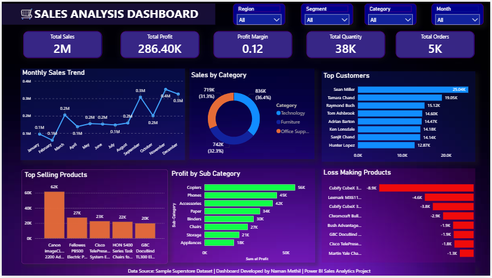

# Sales Analysis Dashboard using Power BI

## Project Overview

This project presents an interactive Sales Analysis Dashboard built using Power BI and the Sample Superstore Dataset. The dashboard provides insights into sales performance, profitability, customer behavior, and product performance through interactive visualizations and KPIs.

---

## Dashboard Features

### KPI Cards

* Total Sales
* Total Profit
* Profit Margin
* Total Quantity
* Total Orders

### Visualizations

* Monthly Sales Trend (Line Chart)
* Sales by Category (Donut Chart)
* Top 10 Customers
* Profit by Sub-Category
* Top 10 Selling Products
* Top 10 Loss Making Products

### Interactive Filters

* Region
* Segment
* Category
* Month

---

## Tools & Technologies

* Power BI Desktop
* DAX (Data Analysis Expressions)
* Microsoft Excel / CSV Dataset
* GitHub

---

## Dataset

Sample Superstore Dataset

---

## Dashboard Preview

---

## Key Insights

* Technology category generated the highest sales.
* Copiers contributed the highest profit among sub-categories.
* Several products generated negative profit and require business attention.
* Sales performance varies significantly across regions and customer segments.

---

## Project Structure

Sales-Analysis-PowerBI/

* Dashboard.pbix
* Dashboard.png
* Dataset.csv
* README.md

---

## Author

Naman Methil
